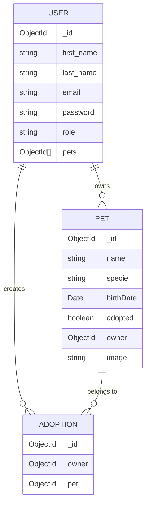

## Overview

The Pet Adoption API uses MongoDB with Mongoose for data persistence. The system has three core data models that work together to manage users, pets, and adoption records.

<CardGroup cols={3}>
  <Card title="User" icon="user">
    Stores user account information and adopted pets
  </Card>
  <Card title="Pet" icon="paw">
    Contains pet details and adoption status
  </Card>
  <Card title="Adoption" icon="heart">
    Records the relationship between users and adopted pets
  </Card>
</CardGroup>

## User Model

The User model represents registered users who can adopt pets. It includes authentication credentials and tracks adopted pets.

### Schema Definition

<CodeGroup>
```javascript User.js
import mongoose from "mongoose";

const collection = "adopme_users";

const schema = new mongoose.Schema({
  first_name: {
    type: String,
    required: true,
  },
  last_name: {
    type: String,
    required: true,
  },
  email: {
    type: String,
    required: true,
    unique: true,
  },
  password: {
    type: String,
    required: true,
  },
  role: {
    type: String,
    default: "user",
  },
  pets: {
    type: [
      {
        _id: {
          type: mongoose.SchemaTypes.ObjectId,
          ref: "Pets",
        },
      },
    ],
    default: [],
  },
});

const userModel = mongoose.model(collection, schema);
export default userModel;
```
</CodeGroup>

### Field Descriptions

<ResponseField name="first_name" type="string" required>
  User's first name
</ResponseField>

<ResponseField name="last_name" type="string" required>
  User's last name
</ResponseField>

<ResponseField name="email" type="string" required>
  User's email address. Must be unique across all users.
</ResponseField>

<ResponseField name="password" type="string" required>
  Hashed password for authentication
</ResponseField>

<ResponseField name="role" type="string" default="user">
  User role for authorization (e.g., "user", "admin")
</ResponseField>

<ResponseField name="pets" type="array" default="[]">
  Array of ObjectId references to adopted pets. Each element references a Pet document.
</ResponseField>

<Note>
  The `pets` array uses MongoDB references (ObjectId) to create a relationship with the Pet collection.
</Note>

## Pet Model

The Pet model represents animals available for adoption. It tracks adoption status and ownership.

### Schema Definition

<CodeGroup>
```javascript Pet.js
import mongoose from "mongoose";

const collection = "adopme_pets";

const schema = new mongoose.Schema({
  name: {
    type: String,
    required: true,
  },
  specie: {
    type: String,
    required: true,
  },
  birthDate: Date,
  adopted: {
    type: Boolean,
    default: false,
  },
  owner: {
    type: mongoose.SchemaTypes.ObjectId,
    ref: "Users",
  },
  image: String,
});

const petModel = mongoose.model(collection, schema);
export default petModel;
```
</CodeGroup>

### Field Descriptions

<ResponseField name="name" type="string" required>
  Pet's name
</ResponseField>

<ResponseField name="specie" type="string" required>
  Pet's species (e.g., "dog", "cat", "bird")
</ResponseField>

<ResponseField name="birthDate" type="Date">
  Pet's date of birth
</ResponseField>

<ResponseField name="adopted" type="boolean" default="false">
  Indicates whether the pet has been adopted
</ResponseField>

<ResponseField name="owner" type="ObjectId">
  Reference to the User who adopted this pet. Only populated when `adopted` is true.
</ResponseField>

<ResponseField name="image" type="string">
  Path to the pet's image file
</ResponseField>

<Tip>
  The `owner` field references the Users collection, creating a bidirectional relationship with the User model.
</Tip>

## Adoption Model

The Adoption model creates a record of each adoption transaction, linking users to their adopted pets.

### Schema Definition

<CodeGroup>
```javascript Adoption.js
import mongoose from "mongoose";

const collection = "adopme_adoption";

const schema = new mongoose.Schema({
  owner: {
    type: mongoose.SchemaTypes.ObjectId,
    ref: "Users",
  },
  pet: {
    type: mongoose.SchemaTypes.ObjectId,
    ref: "Pets",
  },
});

const adoptionModel = mongoose.model(collection, schema);
export default adoptionModel;
```
</CodeGroup>

### Field Descriptions

<ResponseField name="owner" type="ObjectId">
  Reference to the User who adopted the pet
</ResponseField>

<ResponseField name="pet" type="ObjectId">
  Reference to the Pet that was adopted
</ResponseField>

<Note>
  The Adoption model serves as a join table, maintaining a historical record of all adoptions.
</Note>

## Data Relationships

The three models are interconnected through MongoDB references (ObjectIds), creating a relational structure:



### Relationship Types

<AccordionGroup>
  <Accordion title="User to Pets (One-to-Many)">
    A user can adopt multiple pets. The User model stores an array of pet ObjectIds in the `pets` field.
    
    ```javascript
    // User document example
    {
      _id: ObjectId("507f1f77bcf86cd799439011"),
      first_name: "John",
      last_name: "Doe",
      email: "john@example.com",
      pets: [
        { _id: ObjectId("507f191e810c19729de860ea") },
        { _id: ObjectId("507f191e810c19729de860eb") }
      ]
    }
    ```
  </Accordion>

  <Accordion title="Pet to User (Many-to-One)">
    Each pet can have only one owner. The Pet model references the User through the `owner` field.
    
    ```javascript
    // Pet document example
    {
      _id: ObjectId("507f191e810c19729de860ea"),
      name: "Buddy",
      specie: "dog",
      birthDate: ISODate("2020-01-15"),
      adopted: true,
      owner: ObjectId("507f1f77bcf86cd799439011")
    }
    ```
  </Accordion>

  <Accordion title="Adoption Records (Many-to-Many Junction)">
    The Adoption model creates a historical record linking users and pets. Even if a pet's owner changes, the adoption history is preserved.
    
    ```javascript
    // Adoption document example
    {
      _id: ObjectId("507f1f77bcf86cd799439022"),
      owner: ObjectId("507f1f77bcf86cd799439011"),
      pet: ObjectId("507f191e810c19729de860ea")
    }
    ```
  </Accordion>
</AccordionGroup>

## Adoption Flow

When a user adopts a pet, the system updates all three models to maintain data consistency:

<Steps>
  <Step title="Validate User and Pet">
    Verify the user exists and the pet is available (not already adopted)
  </Step>
  <Step title="Update User">
    Add the pet's ObjectId to the user's `pets` array
  </Step>
  <Step title="Update Pet">
    Set `adopted` to `true` and set `owner` to the user's ObjectId
  </Step>
  <Step title="Create Adoption Record">
    Insert a new Adoption document linking the user and pet
  </Step>
</Steps>

<CodeGroup>
```javascript Adoption Flow Example
const createAdoption = async (req, res) => {
  const { uid, pid } = req.params;
  
  // Step 1: Validate
  const user = await usersService.getUserById(uid);
  if (!user) return res.status(404).send({status: "error", error: "user Not found"});
  
  const pet = await petsService.getBy({ _id: pid });
  if (!pet) return res.status(404).send({status: "error", error: "Pet not found"});
  if (pet.adopted) return res.status(400).send({status: "error", error: "Pet is already adopted"});
  
  // Step 2: Update User
  user.pets.push(pet._id);
  await usersService.update(user._id, { pets: user.pets });
  
  // Step 3: Update Pet
  await petsService.update(pet._id, { adopted: true, owner: user._id });
  
  // Step 4: Create Adoption Record
  await adoptionsService.create({ owner: user._id, pet: pet._id });
  
  res.send({ status: "success", message: "Pet adopted" });
};
```
</CodeGroup>

<Warning>
  This multi-step process should ideally be wrapped in a transaction to ensure data consistency if any step fails.
</Warning>

## Collection Names

The API uses the following MongoDB collections:

| Model | Collection Name |
|-------|----------------|
| User | `adopme_users` |
| Pet | `adopme_pets` |
| Adoption | `adopme_adoption` |

## Data Transfer Objects (DTOs)

The API uses DTOs to transform and validate data before persisting to the database:

<CodeGroup>
```javascript Pet.dto.js
export default class PetDTO {
    static getPetInputFrom = (pet) => {
        return {
            name: pet.name || '',
            specie: pet.specie || '',
            image: pet.image || '',
            birthDate: pet.birthDate || '12-30-2000',
            adopted: false
        }
    }
}
```
</CodeGroup>

<Tip>
  DTOs ensure consistent data structure and provide default values before database insertion.
</Tip>